# PoCo-V2 (Polyp Counter)

<p align="center">
  
</p>

## Install

To use the code install python dependencies and CUDA+cuDNN. A prebuilt Windows 
application is also available.

### Dependencies
Using pip install:

Python packages and tested versions
* tensorflow-gpu (1.14.0) and up, but not 2.0
* Keras (2.3.1)
* numpy (1.17.4)
* opencv-python (4.1.1.26)
* PyQt (5.13.2)

Install CUDA and cuDNN:
 * CUDA 10.1 + cuDNN 7.6.5

### Windows Build
A prebuilt version for Windows is available:
* [GPU version](https://drive.google.com/file/d/1XgNJTviLW2RtlKgaVY43PoU1t3EAgoDE)


If a GPU is not available on your system:
* [CPU version](https://drive.google.com/open?id=1ddzgBy9tcwkt361P7Y4rQqlPCKG1gunG)

## Quick Start Demo
###Inference
* Download the test data set from [here](https://drive.google.com/open?id=1IIU-TbTEHuxxtLbrjQGUZ6oIe6wcx2gD) and 
extract it.
* Download the pretrained model from [here](https://drive.google.com/open?id=1kmRR3UttSq0T0GTdtIVEwj0JimZZXHcj)
* Load the images by clicking the "Load Dataset" button and selecting the folder containing the extracted images.
* Run the inference by clicking the "Predict with model" button.
* Once the dialog opens select the pretrained model by clicking the "Change model" button in the dialog and selecting the
 model file.
* Click the "Predict" button in the dialog and wait for the inference to finish. The dialog window 
will close automatically when the process is finished. Please note that this may take 
some time when run on the CPU.
* The detections will be displayed in the main window, with the number of detections displayed on the right side of the
 interface.

### Annotation and Training
* Download the preannotated training data set from [here](https://drive.google.com/open?id=15vDh1aYqUhLWAymR-Ija02-UJrt7NTGt) and 
extract it.
* Download the test data set from [here](https://drive.google.com/open?id=1IIU-TbTEHuxxtLbrjQGUZ6oIe6wcx2gD) and 
extract it.
* Load the images by clicking the "Load Dataset" button and selecting the folder containing the preannotated extracted images.
* The annotations will be displayed in the main image and you can navigate between the images by clicking the image 
names on the image list on the right side of the interface.
* First save the training data using the Ctrl+S shortcut or by clicking the "Save Training Dataset" button and wait 
for the saving process to finish.
* Train on the data using the "Train on current dataset" button. Once the dialog opens
click the "Create a new model" button and pick a location where your trained model will be saved.
* Click "Start training" and the training will begin. Please note that the training process can 
take a long time and may be prohibitively long if a powerful GPU is not available. 
* Once the training stops or you stop the training using the stop training button, the model will be 
saved to the chosen location.
* Open the test dataset by again selecting a new folder using the "Load Dataset" button. You can also run the model 
on the currently opened dataset in which case the model will be run only on regions of the images where the annotations 
aren't present. 
* Click the "Predict with model" button and wait for the dialog to open. Pick the model you just trained using the 
"Change Dataset" button. Then click the Predict button to start the 
inference. Wait until the process is finished and the detections will be displayed on screen.

### Training on your own data
* Place your images in a single folder.
* Load the images by clicking the "Load Dataset" button and selecting the folder containing the images.
* You can navigate between the images by clicking the image 
names on the image list on the right side of the interface.
* Annotate the images using the annotation tools. As this can take a long time it is advisable to save 
the dataset often during annotation.
* First save the training data using the Ctrl+S shortcut or by clicking the "Save Training Dataset" button and wait 
for the saving process to finish.
* Train on the data using the "Train on current dataset" button. Once the dialog opens
click the "Create a new model" button and pick a location where your trained model will be saved.
* Click "Start training" and the training will begin. Please note that the training process can 
take a long time and may be prohibitively long if a powerful GPU is not available. 
* Once the training stops or you stop the training using the stop training button, the model will be 
saved to the chosen location.
* Place your test dataset images in a separate folder.
* Open the test dataset by selecting the test folder using the "Load Dataset" button. You can also run the model 
on the currently opened dataset in which case the model will be run only on regions of the images where the annotations 
aren't present. 
* Click the "Predict with model" button and wait for the dialog to open. Pick the model you just trained using the 
"Change Dataset" button. Then click the Predict button to start the 
inference. Wait until the process is finished and the detections will be displayed on screen.
* Save the detections using the Ctrl+S shortcut.

## Interface and Features:
PoCo-v2 was developed for use in annotating and detecting. Here you can find more detailed instructions for the use of 
each individual annotation tool and interface feature.

<p align="center">
  
</p>


### Loading Data
To load the images in the interface use the Load Dataset button on the left side of the screen. The dataset loading 
dialog will open up. Pick the folder that contains your images. The list of the images will appear on the left side of 
the interface. Select an image from the list to display the image.

### Annotation
After the images have been successfully loaded, you can begin annotating the images.

#### Annotation Tool
There are several annotation tools available. The Positive Annotation tool is used to annotate basic objects on the 
image. The Negative Annotation tool is used to mark regions of the background as containing no annotations to be used 
during training. The Annotation Removal tool is used to quickly remove detections or annotations. The Polygon tool is 
to mark the region of interest.

<p align="center">
  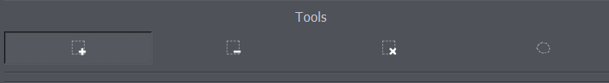
</p>

##### Positive Annotations
<p align="left">
  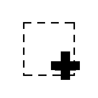
</p>


The positive annotation tool is a basic circular annotation tool. Click on the center of the object and drag away 
from the object to mark it with a circle. You can delete the annotation by holding down Ctrl and clicking on it. You can
 also undo any annotation functions by using the Ctrl+Z shortcut.
 

<p align="center">
  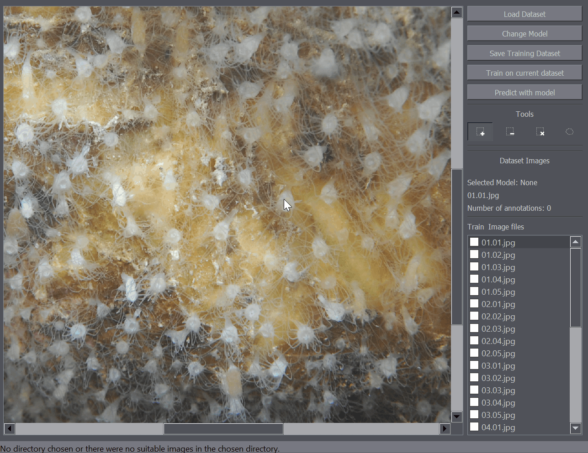
</p>


##### Negative Annotations
<p align="left">
  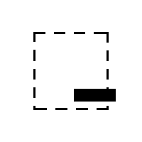
</p>

Negative annotation tool works very similarly to the positive annotation tool except it marks rectangular regions as 
containing no objects.
#### Annotation Removal Tool
<p align="left">
  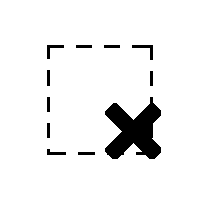
</p>


The annotation removal tool enables quick removal of a large number of annotations. It works as a removal brusih where 
all positive annotations within a certain radius are removed with a click. The brush size (removal radius) can be set in
 the left of the interface when the removal tool is selected.

<p align="center">
  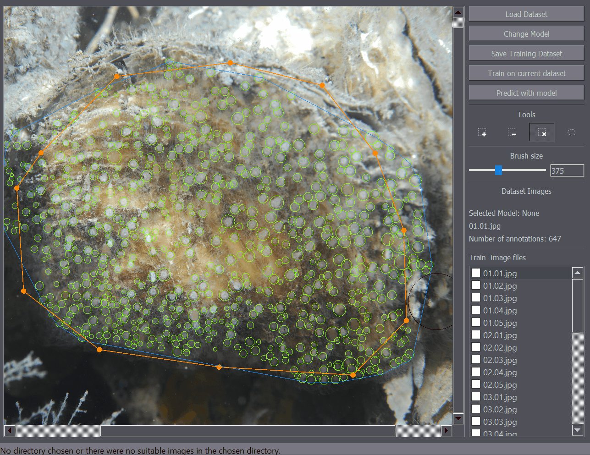
</p>

 
#### Polygon Tool
<p align="left">
  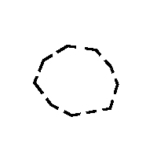
</p>

The polygon tool enables the annotation of regions of interest. For example when you only want to train or detect the 
objects within a certain region of the image, you can mark that portion of the image as a region of interest and only 
that part of the image will be taken into account when training or detecting objects on the image.

<p align="center">
  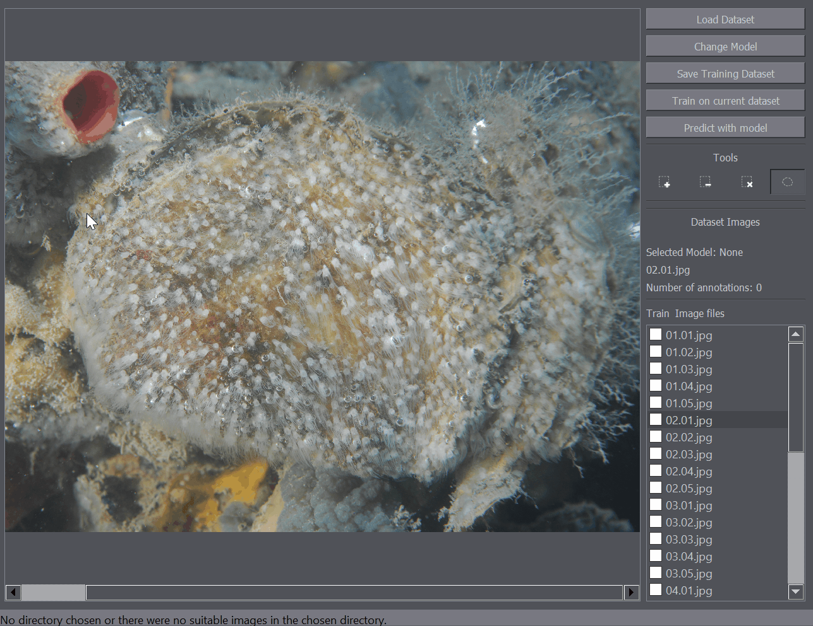
</p>


#### Saving Data
Data can be saved using the Save Training Dataset button on the left side of the interface.
Additionally the saving procedure can be started using the Ctrl+S shortcut. Saving follows a procedure of:

1. The positive, negative and polygon annotations are saved in the image_name_gt_neg.csv, image_name_gt.csv, 
image_name_gt_poly.csv files for each image, respectively. These additional files will be used when loading the dataset 
at a later time.

2. Training masks from the positive, negative and polygon annotations are generated.

3. Training masks and images are stored by creating a training_data folder in the selected dataset folder.

This may take some time depending on the number of annotations and image size so a Saving Dialog will open when the 
saving procedure is started which displays the progress.
<p align="center">
  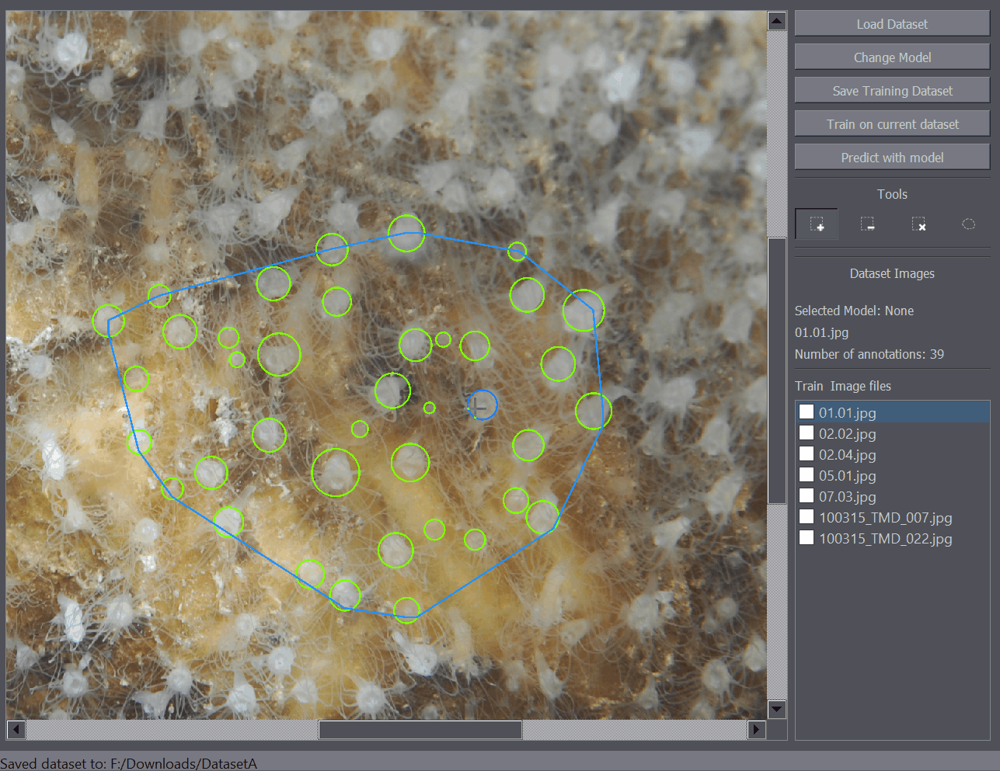
</p>


### Training
After importing the dataset, annotating it, and saving the data, the training procedure can be started.

To start the training, click on the Train on current dataset button. A training dialog will open up.

<p align="center">
  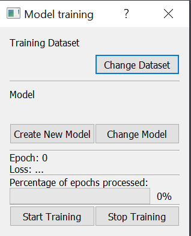
</p>

 
Here you have the chance to change the dataset folder with the Change Dataset button. To start training you first have 
to pick a location where your model will be saved by clicking Create New Model. Make note of this location as you will 
need the trained model to run the detection later. After the model location has been picked the training can be started
 with the Start Training button. You can stop the training at any point using the Stop 
Training button. Please note that the training takes a long time depending on your hardware, the number of images in 
the dataset and their size. Most of the implementation details of the deep learning model have been abstracted. 

### Inference and counting
After the model has been trained, you can run the model on a dataset. To do that click the Predict with model button 
and a dialog will open up.

<p align="center">
  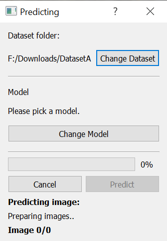
</p>


You again have the option to change the dataset with the Change Dataset button. In order to run the detection on the 
selected dataset you first have to pick the model. Click on the Change Model button and navigate to your trained model. 
After the model has been selected, click on the Predict button to run the detection. The dialog provides information 
about the progress of the detection process. After the detection has been completed, the detected objects will be 
displayed as annotations on the images. You can save the detections using the save function (Ctrl+S).

# Reference
If you use this tool, please cite the following paper:
```
@article{ZAVRTANIK2020103399,
title = "A segmentation-based approach for polyp counting in the wild",
journal = "Engineering Applications of Artificial Intelligence",
volume = "88",
pages = "103399",
year = "2020",
issn = "0952-1976",
doi = "https://doi.org/10.1016/j.engappai.2019.103399",
url = "http://www.sciencedirect.com/science/article/pii/S095219761930315X",
author = "Vitjan Zavrtanik and Martin Vodopivec and Matej Kristan"
}
```
